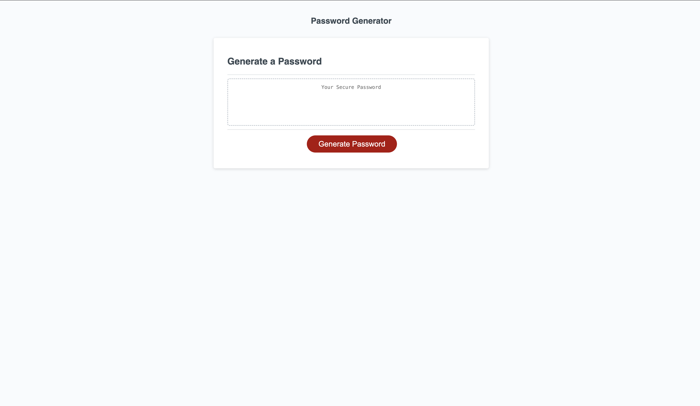

Cedric's Password Generator

Description:
This is a password generator designed for the web, allowing the user to select various criteria go generate a password from a minimum of 8 characters or up to a maximum of 128 characters.  Users can also choose the length and character types from a list of lowercase, uppercase, numerical, or special characters.  Once all valid prompts are answered the user will receive a password based on the selected criteria.  

Visual Screenshot:

Application URL: https://github-cedsim.github.io/Password-Generator/
